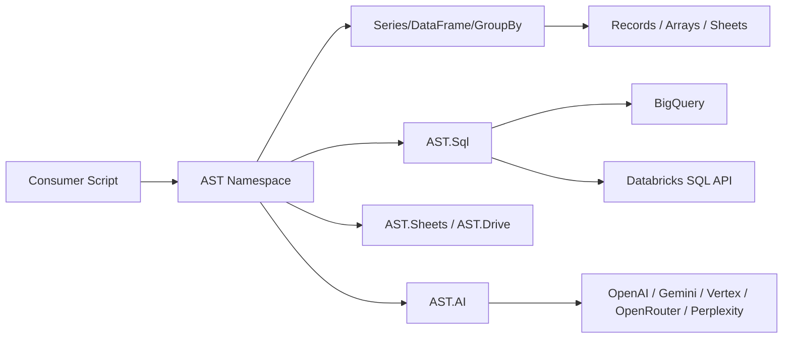

# apps-script-tools

<span class="subtitle">A production-focused Google Apps Script data toolkit</span>

`apps-script-tools` is a library-first toolkit for tabular data workflows in Google Apps Script. It exposes a single public namespace (`AST`) for dataframe-style transforms, SQL execution, and Apps Script workspace IO.

## Who this is for

- Teams building Apps Script automations that need more than raw 2D arrays.
- Projects that need a consistent API across Sheets, Drive, BigQuery, and Databricks.
- Library consumers who want a typed interface (`Series`, `DataFrame`, `GroupBy`) in Apps Script.

## Core surfaces

- `AST.Series`: vector-style operations over one column.
- `AST.DataFrame`: tabular transforms, joins, grouping, sorting, output.
- `AST.GroupBy`: grouped aggregations and grouped transforms.
- `AST.Sheets`: sheet open helpers and enhanced sheet classes.
- `AST.Drive`: read/write helpers for drive-backed file workflows.
- `AST.AI`: multi-provider text, structured output, tool calling, and image generation.
- `AST.Sql`: validated SQL execution for Databricks and BigQuery.
- `AST.Utils`: utility helpers (`arraySum`, `dateAdd`, `toSnakeCase`, and others).

## Architecture at a glance



## Public release

- Current published release: `v0.0.1`
- Next release target on `master`: `v0.0.3` (release candidate, not tagged yet)
- Script ID: `1gZ_6DiLeDhh-a4qcezluTFDshw4OEhTXbeD3wthl_UdHEAFkXf6i6Ho_`
- Docs: <https://joe-broadhead.github.io/apps-script-tools/>

## Import pattern

In consumer projects, use the library identifier you configured (recommended: `ASTLib`) and normalize once:

```javascript
const ASTX = ASTLib.AST || ASTLib;
```

Then use `ASTX.DataFrame`, `ASTX.Series`, `ASTX.Utils`, and so on.
