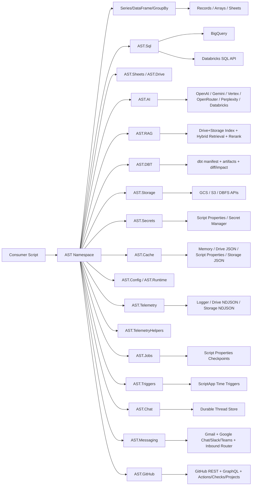

# apps-script-tools

<span class="subtitle">A production-focused Google Apps Script data toolkit</span>

`apps-script-tools` is a library-first toolkit for production Apps Script workflows. It exposes a single public namespace (`AST`) for dataframe transforms, SQL execution, workspace helpers, AI/RAG, storage, caching, telemetry, jobs, and chat state.

## Who this is for

- Teams building Apps Script automations that need more than raw 2D arrays.
- Projects that need a consistent API across Sheets, Drive, BigQuery, and Databricks.
- Library consumers who want a typed interface (`Series`, `DataFrame`, `GroupBy`) in Apps Script.

## Core surfaces

- `AST.Series`: vector-style operations over one column.
- `AST.DataFrame`: tabular transforms, joins, grouping, sorting, output.
- `AST.GroupBy`: grouped aggregations and grouped transforms.
- `AST.Sheets`: sheet open helpers and enhanced sheet classes.
- `AST.Drive`: read/write helpers for drive-backed file workflows.
- `AST.Http`: shared transport helpers for retries, timeout budgets, and typed request errors.
- `AST.AI`: multi-provider text/structured/tools/image workflows (`openai`, `gemini`, `vertex_gemini`, `openrouter`, `perplexity`, `databricks`).
- `AST.RAG`: Drive + Storage URI indexing (`gcs://`, `s3://`, `dbfs:/`), hybrid retrieval, reranking, query transforms, incremental sync, and grounded citation answers.
- `AST.DBT`: dbt artifact loading (`manifest`, `catalog`, `run_results`, `sources`) with search, lineage, diff, and impact overlays.
- `AST.Storage`: cross-provider object storage for GCS, S3, and DBFS (CRUD + transfer/sync helpers).
- `AST.Secrets`: secure secret resolution from script properties and Google Secret Manager.
- `AST.Cache`: backend-agnostic cache layer for repeated computations and API responses (single-key + batch ops, invalidation, stats).
- `AST.Config`: script-properties snapshots + typed schema binding for resolver config.
- `AST.Runtime`: runtime configuration hydration across AST namespaces.
- `AST.Telemetry`: request-level tracing spans/events with redaction and sink controls.
- `AST.TelemetryHelpers`: safe wrappers for span lifecycle orchestration.
- `AST.Jobs`: script-properties checkpointed multi-step job runner with retry/resume and status controls.
- `AST.Triggers`: declarative time-based trigger upsert/list/delete with optional Jobs dispatch.
- `AST.Chat`: durable user-scoped thread persistence and bounded history assembly.
- `AST.Messaging`: Google Email + Google Chat/Slack/Teams sends, template registry/render/send, inbound webhook verify/parse/route, tracking, and logs.
- `AST.GitHub`: GitHub REST + GraphQL automation with dry-run planning, cache/ETag, Actions, Checks, and Projects v2 helpers.
- `AST.Sql`: validated SQL execution for Databricks and BigQuery.
- `AST.Utils`: utility helpers (`arraySum`, `dateAdd`, `toSnakeCase`, and others).

## Architecture at a glance


```mermaid
flowchart LR
    A[Consumer Script] --> B[AST Namespace]
    B --> C[Series/DataFrame/GroupBy]
    B --> D[AST.Sql]
    B --> E[AST.Sheets / AST.Drive]
    B --> I[AST.AI]
    B --> K[AST.RAG]
    B --> Y[AST.DBT]
    B --> M[AST.Storage]
    B --> AA[AST.Secrets]
    B --> Q[AST.Cache]
    B --> S[AST.Config / AST.Runtime]
    B --> O[AST.Telemetry]
    B --> TH[AST.TelemetryHelpers]
    B --> T[AST.Jobs]
    B --> AC[AST.Triggers]
    B --> W[AST.Chat]
    B --> ME[AST.Messaging]
    B --> GH[AST.GitHub]
    D --> F[BigQuery]
    D --> G[Databricks SQL API]
    I --> J[OpenAI / Gemini / Vertex / OpenRouter / Perplexity / Databricks]
    K --> L[Drive+Storage Index + Hybrid Retrieval + Rerank]
    Y --> Z[dbt manifest + artifacts + diff/impact]
    M --> N[GCS / S3 / DBFS APIs]
    AA --> AB["Script Properties / Secret Manager"]
    Q --> R["Memory / Drive JSON / Script Properties / Storage JSON"]
    O --> P[Logger / Drive NDJSON / Storage NDJSON]
    T --> U["Script Properties Checkpoints"]
    AC --> AD["ScriptApp Time Triggers"]
    W --> X["Durable Thread Store"]
    ME --> MM["Gmail + Google Chat/Slack/Teams + Inbound Router"]
    GH --> GHAPI[GitHub REST + GraphQL + Actions/Checks/Projects]
    C --> H[Records / Arrays / Sheets]
```

## Public release

- Current published release: `v0.0.4`
- Next release target on `master`: `v0.0.5` (unreleased)
- Script ID: `1gZ_6DiLeDhh-a4qcezluTFDshw4OEhTXbeD3wthl_UdHEAFkXf6i6Ho_`
- Docs: <https://joe-broadhead.github.io/apps-script-tools/>

## `v0.0.5` (unreleased) highlights

- `AST.GitHub` expanded with Actions (`listWorkflows`, `listWorkflowRuns`, `rerunWorkflowRun`), Checks (`listCheckRuns`, `createCheckRun`), and Projects v2 helpers.
- `AST.RAG` expanded with `answerStream`, `incrementalSync`, `rerank`, `rewriteQuery`, and `decomposeQuestion`.
- `AST.DBT` expanded with artifact loaders/inspectors, `compareArtifacts`, `columnLineage`, and governance helpers (`owners`, `searchOwners`, `ownerCoverage`).
- `AST.Messaging` expanded with template APIs (`register/get/render/send`) and inbound webhook verification/routing (`verify/parse/route`) plus Slack/Teams transports.
- `AST.Jobs` expanded with DLQ lifecycle (`listFailed`, `moveToDlq`, `replayDlq`, `purgeDlq`) and orchestration helpers (`enqueueMany`, `chain`, `mapReduce`, `schedule`).
- `AST.Cache` expanded with batch APIs (`getMany`, `setMany`, `fetchMany`, `deleteMany`) plus `invalidateByPrefix`, `invalidateByPredicate`, and `lock`.
- `AST.Storage` expanded with `transfer`, `walk`, `copyPrefix`, `deletePrefix`, and `sync`.
- `AST.Telemetry` expanded with query/aggregation/export plus alert rules and notification pipeline APIs.
- `AST.Secrets` expanded with `rotate`, `listVersions`, and `getVersionMetadata`.
- `AST.Config` expanded with typed schema/profile APIs (`schema`, `bind`, `setProfile`, `getProfile`, `resolveProfile`).
- DataFrame/Series parity finishers shipped: `DataFrame.stack/unstack/resample` and `Series.expanding/ewm`.

For released highlights, use `CHANGELOG.md` (for example `v0.0.4`).

## Import pattern

In consumer projects, use the library identifier you configured (recommended: `ASTLib`) and normalize once:

```javascript
const ASTX = ASTLib.AST || ASTLib;
```

Then use `ASTX.DataFrame`, `ASTX.Series`, `ASTX.Utils`, and so on.
