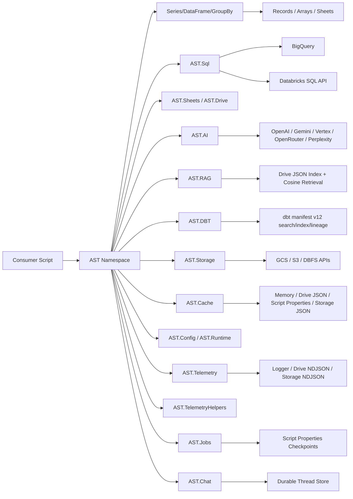

# apps-script-tools

<span class="subtitle">A production-focused Google Apps Script data toolkit</span>

`apps-script-tools` is a library-first toolkit for production Apps Script workflows. It exposes a single public namespace (`AST`) for dataframe transforms, SQL execution, workspace helpers, AI/RAG, storage, caching, telemetry, jobs, and chat state.

## Who this is for

- Teams building Apps Script automations that need more than raw 2D arrays.
- Projects that need a consistent API across Sheets, Drive, BigQuery, and Databricks.
- Library consumers who want a typed interface (`Series`, `DataFrame`, `GroupBy`) in Apps Script.

## Core surfaces

- `AST.Series`: vector-style operations over one column.
- `AST.DataFrame`: tabular transforms, joins, grouping, sorting, output.
- `AST.GroupBy`: grouped aggregations and grouped transforms.
- `AST.Sheets`: sheet open helpers and enhanced sheet classes.
- `AST.Drive`: read/write helpers for drive-backed file workflows.
- `AST.AI`: multi-provider text, structured output, tool calling, and image generation.
- `AST.RAG`: Drive-backed indexing, retrieval, and grounded answering with citations.
- `AST.DBT`: dbt `manifest.json` loading, preindexing, search, deep metadata lookup, and lineage traversal.
- `AST.Storage`: cross-provider object storage for GCS, S3, and DBFS.
- `AST.Cache`: backend-agnostic cache layer for repeated computations and API responses (single-key ops + invalidation/stats).
- `AST.Config`: script-properties snapshot helpers for configuration bootstrap.
- `AST.Runtime`: runtime configuration hydration across AST namespaces.
- `AST.Telemetry`: request-level tracing spans/events with redaction and sink controls.
- `AST.TelemetryHelpers`: safe wrappers for span lifecycle orchestration.
- `AST.Jobs`: script-properties checkpointed multi-step job runner with retry/resume and status controls.
- `AST.Chat`: durable user-scoped thread persistence and bounded history assembly.
- `AST.Sql`: validated SQL execution for Databricks and BigQuery.
- `AST.Utils`: utility helpers (`arraySum`, `dateAdd`, `toSnakeCase`, and others).

## Architecture at a glance



## Public release

- Current published release: `v0.0.4`
- Next release target on `master`: `v0.0.5` (unreleased)
- Script ID: `1gZ_6DiLeDhh-a4qcezluTFDshw4OEhTXbeD3wthl_UdHEAFkXf6i6Ho_`
- Docs: <https://joe-broadhead.github.io/apps-script-tools/>

## `v0.0.5` (unreleased) highlights

- `AST.DBT` namespace for dbt `manifest.json` operations.
- Multi-provider artifact loading (`drive://`, `gcs://`, `s3://`, `dbfs:/`) with Drive fileId fallback.
- v12 validation modes (`strict`, `basic`, `off`) with typed schema/load/parse errors.
- Fast preindexed bundle for repeated `search`, `getEntity`, `getColumn`, and `lineage` queries.

For released highlights, use `CHANGELOG.md` (for example `v0.0.4`).

## Import pattern

In consumer projects, use the library identifier you configured (recommended: `ASTLib`) and normalize once:

```javascript
const ASTX = ASTLib.AST || ASTLib;
```

Then use `ASTX.DataFrame`, `ASTX.Series`, `ASTX.Utils`, and so on.
